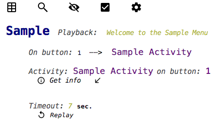

Voice Menu - Language
=======================

How to use
==========
Simple guide showing how to build the very first voice menu.

Introduction
------------
The VoiceMenu project aims to simplify both creating and maintaining voicemenus. Possible generation languages are: Asterisk, Java, Xml, Html. Java output is suggested to use during development as an example how the resulting voicemenu behaves.

Let's start with explainig basic idea how it works. 
A Voicemenu designer is asked to fill in (just as in a simple web page) necessary fields according to their preferences.
A Voicemenu consists of Events which are connected with their descedant Events via triggers (phone buttons pressed by a customer on their cellphone).

Basics
------
An user of VoiceMenu DSL language is asked to fill in (just as in a simple webpage) the necessary fields according to their preferences. A Voicemenu consists of Events which are connected with their descendant Events via triggers (phone buttons pressed by a customer on their cell phone).

Each Event must have set 3 properties:

* Name – represents the name of the Event.
* Trigger – phone key (0..9,*,#), pressed on a cell phone, to navigate from one Event to another.
* Action – place to specify what really happens according to Events name and trigger. Name and Action are completely different concepts, though in some cases they might seem similar.
* Playback - record or text which is played in activity.

Name and Action are completely different concepts! Having said that, in a few cases they might seem similiar.

Let's focus on Actions.

The MPS Voicemenu project supports 7 different actions:
* Back – jump to the previous menu
* Direct Call – call a specific number
* Get Information – play a record with information
* Hang Up – end a phone call
* Record – make a voice record of customer’s input
* Repeat options – repeat options in a current menu
* Menu – create a new (sub)menu

Guide
-------

* [First Steps](https://github.com/vaclav/voicemenu/blob/master/languages/jetbrains.mps.samples.VoiceMenu/FIRSTSTEPS.md) - Creating very first menu
* [Editing Rules](https://github.com/vaclav/voicemenu/blob/master/languages/jetbrains.mps.samples.VoiceMenu/EDITINGRULES.md) - Exploring options and fixing errors
* [Advanced Options](https://github.com/vaclav/voicemenu/tree/master/languages/jetbrains.mps.samples.VoiceMenuTabularEditor) - Using advanced features

Sample
------

A little demonstration of what an editor looks like

Toolbar
-------

Toolbar with action buttons for more pleasant usage

     Switch Editor Hints to Tabular

     Switch Editor Hints to Structural

     Find Error in code

     Hide Toolbar

     Fix all errors in code

         Show/Hide Settings

