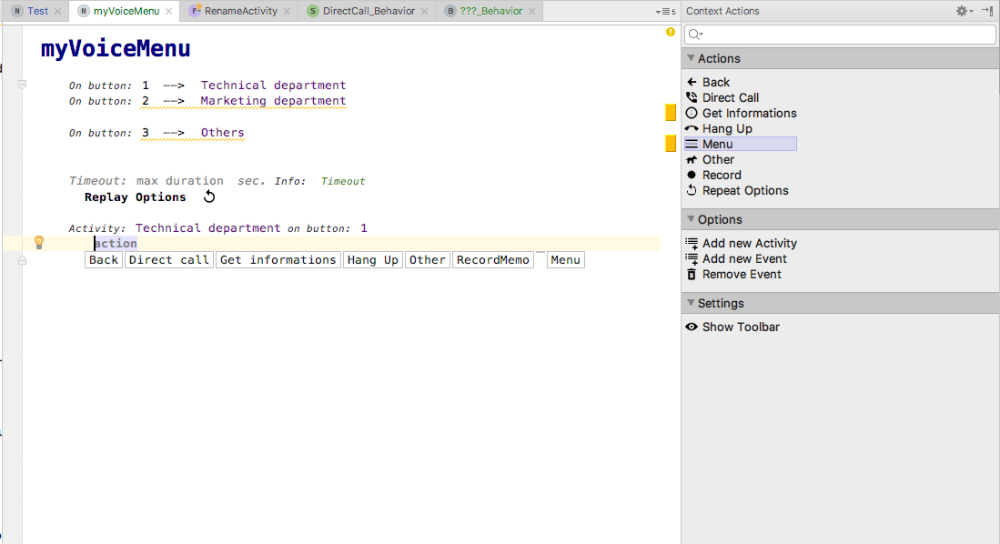
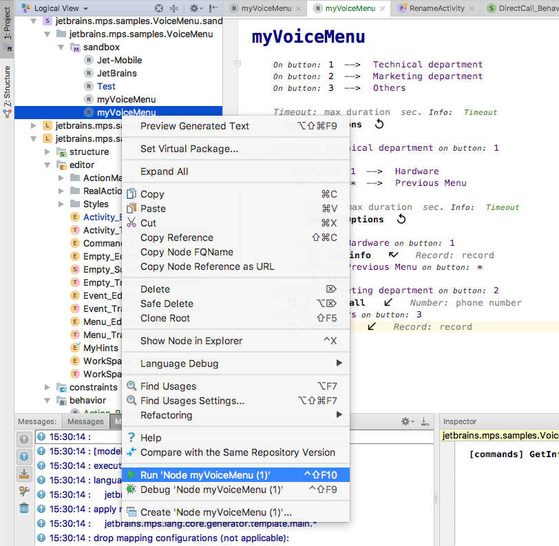
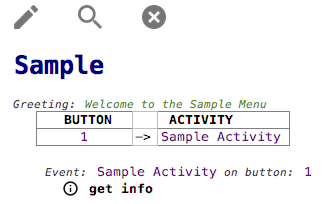

Voice Menu - Language
=======================

How to use
==========
Simple guide showing how to build the very first voice menu.

Introduction
------------
The VoiceMenu project aims to simplify both creating and maintaining voicemenus. Possible generation languages are: Asterisk, Java, Xml, Html. Java output is suggested to use during development as an example how the resulting voicemenu behaves.

Let's start with explainig basic idea how it works. 
A Voicemenu designer is asked to fill in (just as in a simple web page) necessary fields according to their preferences.
A Voicemenu consists of Events which are connected with their descedant Events via triggers (phone buttons pressed by a customer on their cellphone).

Basics
------
An user of VoiceMenu DSL language is asked to fill in (just as in a simple webpage) the necessary fields according to their preferences. A Voicemenu consists of Events which are connected with their descendant Events via triggers (phone buttons pressed by a customer on their cell phone).

Each Event must have set 3 properties:

* Name – represents the name of the Event.
* Trigger – phone key (0..9,*,#), pressed on a cell phone, to navigate from one Event to another.
* Action – place to specify what really happens according to Events name and trigger. Name and Action are completely different concepts, though in some cases they might seem similar.

Name and Action are completely different concepts! Having said that, in a few cases they might seem similiar.

Let's focus on Actions.

The MPS Voicemenu project supports 7 different actions:
* Back – jump to the previous menu
* Direct Call – call a specific number
* Get Information – play a record with information
* Hang Up – end a phone call
* Record – make a voice record of customer’s input
* Repeat options – repeat options in a current menu
* Menu – create a new (sub)menu

Step by Step guide
==================
To start with your first voice menu, create a new model in the sandbox solution with WorkSpace as the root. (The  advanced shortcut for autocomplete is Ctrl + Space; to invoke intentions, press Alt + Enter.)
In the first step we assign triggers (phone buttons) and names to activities. Simply fill in each gap one by one. Add up to 12 buttons. Use the Context Action panel (the one on the right side). Only valid options are shown there for every required field.

As we completed the first step, let's move on to the second one - specifying the action. To do this, click `Set up` in the Context Action panel (or anywhere else you can click  `Set up ..` 

At the second step, we select what actually happens under the hood of the Event which we gave the trigger (phone button) and that shiny name in the first step. Both the name and the trigger of the Event are completed automatically. Choose if the Event is a Menu (select Menu) or a concrete Action.
 

Fill in the rest of the Events. Remember: all events are created in the very same way/ Every Event has its own name even it’s the same as the name of an action. For example: A voicemenu designer would like to have an Event on the button 2 with the action Direct Call.
* A possible solution might be an Event with properties: name = "Direct Call" , trigger = 2, activity = Direct Call.
 

Let's try the very first solution. Rebuild the whole project. At the very top of the screen click `Build` and choose `Rebuild Project`. Right click the myVoicemenu sandbox solution in the left panel and choose `Run` .

Intentions
----------

In most cases different intentions are specified for each of nodes.
All intentions are invoked by pressing `Alt + Enter` shortcut.

|Event Declaration|Activity|Action|Global|
|-----------------|--------|------|------|
|Sort Ascendind|Initiliaze New Event|Change Action to Back|Hide Toolbar|
|Sort Descending|Make Declaration|Change Action to Other|Show Toolbar|
|Move Up|Remove Greeting|Change Action to Direct Call|Show as Structural|
|Move Down|Add Greeting|Change Action to Get Info|Show as Tabular|
|Remove Evnt. + its Actvt.|Remove Actvt. + its Evnt.|Change Action to Menu|||

TypeSystem
----------
Different errors invoke different quickfixes.

|Checking rule| |QuickFix|
|-------------|-|--------|
|CheckActionImplemented|-->|InitilizeEvent|
|CheckDuplicateNumber|-->|RemoveNumber|
|CheckDuplicateNumber|-->|SuggestNumber|
|CheckEmptyMenu|-->|InitiliazeMenu|
|CheckPhoneButtons|-->|SuggestNumber|
|CheckMultipleActvOneEvnt|-->|RemoveActivity|
|CheckMultipleActvOneEvnt|-->|RenameActivity|

Sample
------

A little demonstration of what an editor looks like

Toolbar
-------

Toolbar with action buttons for more pleasant usage

    Switch Editor Hints

    Find Error in code

    Hide Toolbar
