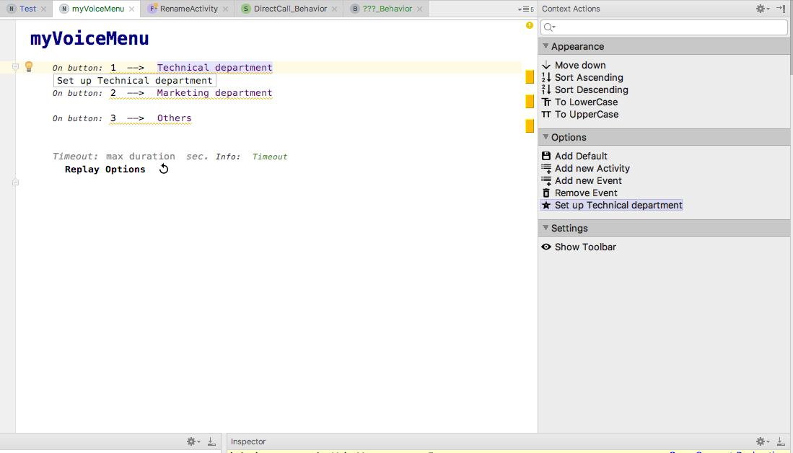
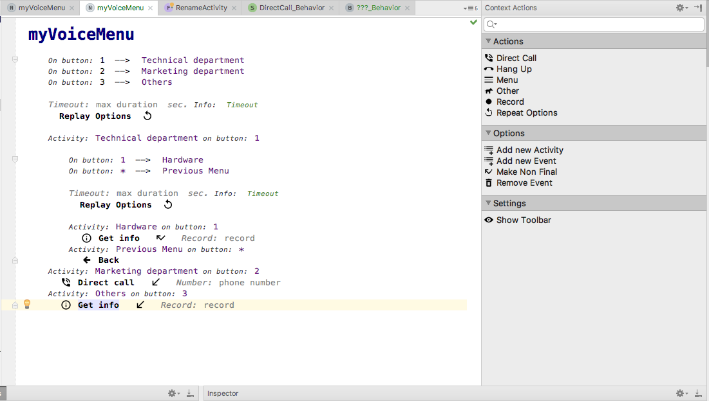

Voice Menu - Language
=======================

How to use
==========
Simple guide showing how to build the very first voice menu.

Introduction
------------

Let's start with explainig basic idea how it works. 
Voicemenu designer is asked to fill in (just as in a simple web page) necessary fields according to their preferences.
Voicemenu consists of Events which are connected with their descedant Events via triggers (phone buttons pressed by a customer on their cellphone).

Basics
------

Each Event must have set 3 properties: 
1 Name
2 Trigger
3 Action

* Name - Obviously represents name of its Event.
* Trigger - Phone button (0..9,*,#), pressed on a cellphone, to navigate from an Event to another one.
* Action - Place to specify what really happens according to Events name and trigger
Name and Action are completely different concepts! Having said that, in a few cases they might seem similiar.

Let's focus on Actions.

MPS Voicemenu project supports 7 different actions.
* Back - Jump to previous menu
* Direct Call - Call specific number
* Get Information - Play a record with information
* Hang Up - End a phonecall
* Record - Make a voicerecord of customers input
* Repeat options - repeat options in a current menu
* Menu - create a new (sub)menu.

Step by Step guide
==================
To start with your first voice menu create a new model in the sandbox solution with `WorkSpace` as the root. 
(Supported advanced shortcut for autocomplete is `Ctrl + Space` and to invoke intentions is `Alt + Enter`)

In the first step we assign triggers (phone buttons) and names to activities.
Simply fill in in each gap one by another. Add upto 12 buttons. Use Context Action panel (the one on the rigth side). Only suitable options are shown there for every field that needs to fill in.

As we completed the first step let's move onto the second one - specifying action. To this click on `Set up ..`in the Context Action panel (or anywhere else on a title `Set up ..` )

In the second step we select what actually happens under the hood to the activity which we gave its trigger ( phone button) and that shiny name in the first step.
Both the name and the trigger of the Activity are completed automatically. Choose if the Activity is Menu (select Menu) or is a concrete Action. 

Fill the rest of the Events. 
Remember: All events are created in the very same way! Every Evet has its own name even if the name might be the same as what an action is called. For example: Voicemenu designer would like to have an Event on the button 2 with the action Direct Call.
* Possible solution might be an Event with properties: **name** = "Direct Call" , **trigger** = 2 , **activity** = Direct Call 

Let's try the very first solution!
Rebuild the whole project. At the very top of the screen click on `Build` and choose `Rebuild Project`.
Right click the myVoicemenu sandbox solution in the left panel and choose `Run` .

Intentions
----------

Mostly different intentions are specified for each of nodes.
All intentions are invoked by pressing `Alt + Enter` shortcut.

|Event Declaration|Activity|Action|Global|
|-----------------|--------|------|------|
|Sort Ascendind|Initiliaze New Event|Change Action to Back|Hide Toolbar|
|Sort Descending|Make Declaration|Change Action to Other|Show Toolbar|
|Move Up|Remove Greeting|Change Action to Direct Call|Show as Structural|
|Move Down|Add Greeting|Change Action to Get Info|Show as Tabular|
|Remove Evnt. + its Actvt.|Remove Actvt. + its Evnt.|Change Action to Menu|||

TypeSystem
----------
Different errors invoke different quickfixes.

|Checking rule| |QuickFix|
|-------------|-|--------|
|CheckActionImplemented|-->|InitilizeEvent|
|CheckDuplicateNumber|-->|RemoveNumber|
|CheckDuplicateNumber|-->|SuggestNumber|
|CheckEmptyMenu|-->|InitiliazeMenu|
|CheckPhoneButtons|-->|SuggestNumber|
|CheckMultipleActvOneEvnt|-->|RemoveActivity|
|CheckMultipleActvOneEvnt|-->|RenameActivity|

Place where the language is defined

Sample
------

A little demonstration of what an editor looks like

Toolbar
-------

Toolbar with action buttons for more pleasant usage

    Switch Editor Hints

    Find Error in code

    Hide Toolbar
